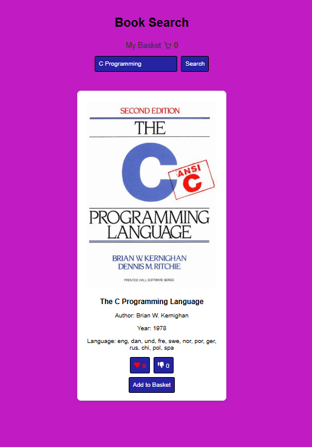
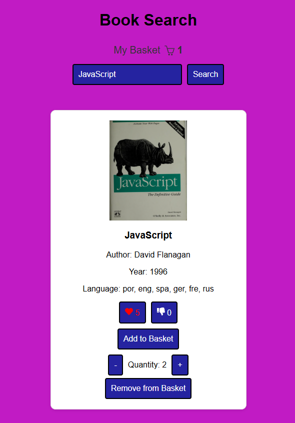
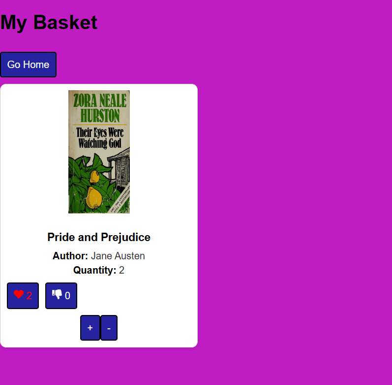
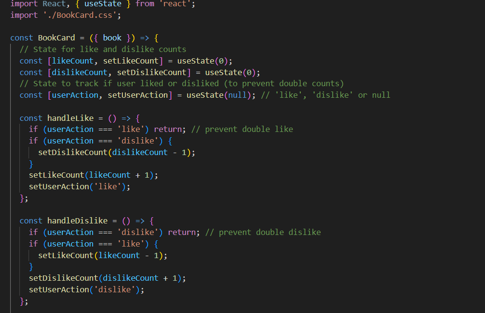

# 📚 React Books

> The **React Books** project allows users to search for books by title using the Open Library API and Axios. When a user enters a book title, the app fetches and displays key information such as the book’s image, name, author(s), first publication year, and languages. Additionally, users can like or dislike books as an interactive feature and My Basket.

- [📚 React Books](#-react-books)
  - [General Info](#general-info)
  - [Screenshots](#screenshots)
  - [Features](#features)
  - [My Basket](#my-basket)
  - [Code Example](#code-example)
  - [Technologies](#technologies)
  - [Status](#status)
  - [Inspiration](#inspiration)
  - [Contact](#contact)

---

## General Info

> This React application allows users to search books by title, fetching real-time data using the Open Library API. It presents key book information, including the cover image, title, author(s), first published year, and available languages. The app also includes like/dislike functionality, making it more engaging for users. It is a great exercise in working with external APIs, Axios, state management using React hooks, and responsive UI.

---

## Screenshots

  
 
 

---

## Features

- 🔍 Search for books by title
- 📘 Display:
  - Book cover image
  - Title
  - Author(s)
  - First published year
  - Languages
- ❤️ Like and 👎 Dislike interactive buttons
- 🌐 Axios for API requests
- 🧱 Modular components (React)
- ⚠️ Error handling with fallback to default books
- My Basket

---

## My Basket

> The **My Basket** section stores all the books that a user has liked. It functions as a personalized list, allowing users to revisit their favorite titles easily. This adds an element of persistence and user engagement, acting like a reading wishlist and add and remove from my Basket.

**Current Capabilities:**

- 💾 Save liked books during session
- 🧾 View all liked books in a dedicated “My Basket” section
- 🗑️ Optionally remove books from the basket (if implemented)

**Possible Improvements:**

- 🔐 Persist liked books to local storage or a backend
- 📲 Allow sharing of a user's basket
- 📚 Add sorting/filtering by author, year, etc.

---

## Code Example

---

## Technologies

- React.js (with Hooks)
- useContext
- React router dom
- Axios
- HTML5
- CSS3 (Grid & Flexbox)
- [Open Library API](https://openlibrary.org/search.json?title=)
- Git & GitHub
- Visual Studio Code

---

## Status

✅ **Project Completed**  
📌 Future enhancements could include:
- Pagination for more results
- Book details modal view
- Save liked books to local storage or backend

---

## Inspiration

This project was built as part of a personal learning initiative to:

- Gain proficiency with React and component-based architecture
- Learn how to integrate third-party APIs with Axios
- Improve front-end styling using responsive CSS
- Enhance UI/UX with interactivity like like/dislike features

---

## Contact

**Sajid Hussain**  
🔗 [GitHub Profile](https://github.com/SajidHussainabbasi)

---